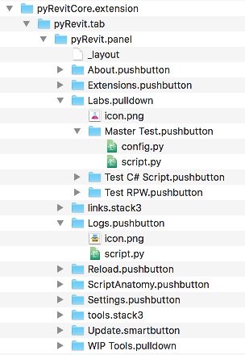
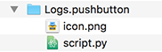
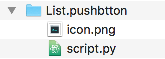
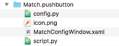
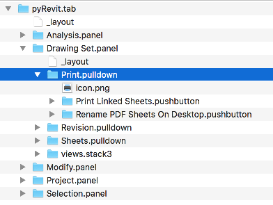

Extensions and Commmands
========================

Why do I need an Extension
--------------------------

pyRevit's extensions system has evolved again to be more flexible and easier to
work with. We'll dive right into how you can add your own extension, but first let's answer one important question:

**Q:**
Why would I need to create a separate extension? Why Can't I just add my scripts to the current pyRevit tools?

**A:**
Because pyRevit is a git repository and the real benefit of that is that you
can keep it always updated without the need to unsinstall and install the
newer versions. To keep this system running without issues, I highly recommend not
to mess with the pyRevit git repository folders and contents and pyRevit makes
it really easy to add your own extensions. You can even add tools to the standard
pyRevit tab in your own extensions. I'll show you how.

Besides, by creating a separate extension, you'll have all your precious scripts
and tools in a safe place and away from the changes being made to the core pyRevit.
They can even live somewhere on your company shared drives and be shared between your teams.

Extensions
----------

Each extension is a group of tools, organized in bundles to be easily accessible through the user interface.

Extensions are organized in a folder bundle with ``.extension`` postfix.

Like this one:

There are two steps that you need to follow to create your own extensions:

* Setup external extension folder:

    First, is to create a separate folder for all your custom extensions and tell
    pyRevit to load your extensions from this folder. This is done in the Settings window,
    under the Custom Extension folders section. This way your precious extensions
    will stay out of the pyRevit installation and are safe.

    .. image:: _static/images/customextfolder.png

* Create custom extension bundle:

    Next, create your ``<your extension name>.extension`` folder under your custom
    extensions folder. Read the sections below on how to create bundles for your commands and the user interface.

Command Bundles
---------------

A bundle is a folder named in the format ``bundle_name.bundle_type``.

Like these:

The most basic bundle is a command bundle. There are more than one type of
command bundles but a ``.pushbutton`` bundle explained here covers 90% of the use cases.

Pushbutton Bundle
^^^^^^^^^^^^^^^^^

Each command bundle needs to include a script either in python or C#:

**script.py**:

    The first script file under the bundle that ends with ``script.py`` will be
    used as the script for this command bundle.

    Examples: ``BuildWall_script.py`` ``Analyse-script.py``

**config.py**:

    This for python commands configuration.
    If this script is provided then Shift-Clicking on the button will run this
    command instead. Also a black dot will be added to the button name in the
    user interface to show that this command has a custom configuration tool.
    See :ref:`shiftclick`

**script.cs**:

    This for C# commands and works similarly to python scripts. This C# script
    will be compiled in runtime.

**icon.png**:

    Command bundles can include an icon for their user interface.

**lib/**:

    Bundles can define a python library (a sub-folder named `lib` inside the bundle will do).
    This library will be accessible to the python script in this bundle.
    This organizes all the python modules that are necessary for this python script to work into one folder.

This is how a command bundle looks like:

And this is a more advanced command bundle with a configuration script and configuration window definition file:

Group Bundles
-------------

Now that we have explained the command bundles, we need a way to organize these
commands into a user-friendly interface. Let's introduce **Group Bundles**

A group bundle is a bundle that can contain command bundles and other group bundles.
They come in all different shapes and sizes but they have a few features in common:

* They can contain command bundles and other group bundles. (But I've already said that)
* **icon.png**: Bundle can include an icon for their user interface.
* **lib/**: The can define a python library (a sub-folder named ``lib`` inside the bundle will do). This library will be accessible to all the commands in this bundle and other child group bundles. This folder can contain all the python modules that are being shared between the child commands.
* **_layout**: This is a text file inside the bundle that defines the order in which the bundle contents should be created in the user interface. The contents of this file should be the names of the component in the order that they should be created in the user interface.

Here is ``_layout`` file example. This is a layout file for a Group Bundle that
has a series of push buttons and other group bundles under itself:

.. code-block:: text

    PushButton A
    PushButton B
    PullDown A
    ---
    PullDown B
    Stack3 A
    >>>
    PushButton C
    PullDown C

Oh, and also:

* ``---`` This line will add a separator to the interface (You can use more than 3 ``-`` characters. For example ``----------`` still works as a separator)
* ``>>>`` Any bundle after this line will be created inside a slide-out. This works for panel bundles only. (You can use more than 3 ``>`` characters. For example ``>>>>>>>>>`` still works as a slide-out)

And this is how a typical Group Bundle looks like:

Now let's talk about the different Group Bundles:

Tab Bundle
^^^^^^^^^^

This bundle creates a Tab in the Ribbon with the bundle name.

+------------------+----------------------------------+
|    Example       |      **Can Contain**             |
+------------------+----------------------------------+
| ``pyRevit.tab``  |  Only ``.panel`` Group Bundles.  |
+------------------+----------------------------------+

Panel Bundle
^^^^^^^^^^^^

This bundle creates a Panel in a Ribbon Tab with the bundle name.

+--------------------+----------------------------------+
|    Example         |      **Can Contain**             |
+--------------------+----------------------------------+
| ``pyRevit.panel``  |  Any other bundle type           |
+--------------------+----------------------------------+

PullDown Bundle
^^^^^^^^^^^^^^^

This bundle creates a Pulldown Button in a Ribbon Panel or a Stack, with the bundle name and icon.

+-----------------------+----------------------------------+
|    Example            |      **Can Contain**             |
+-----------------------+----------------------------------+
| ``pyRevit.pulldown``  |  Only command bundles            |
+-----------------------+----------------------------------+

SplitButton Bundle
^^^^^^^^^^^^^^^^^^

This bundle creates a Split Button button in a Ribbon Panel or a Stack, with the bundle name and icon.

+--------------------------+----------------------------------+
|    Example               |      **Can Contain**             |
+--------------------------+----------------------------------+
| ``pyRevit.splitbutton``  |  Only command bundles            |
+--------------------------+----------------------------------+

SplitPushButton Bundle
^^^^^^^^^^^^^^^^^^^^^^

This bundle creates a Split Push Button button (The sticky split button) in a
Ribbon Panel or a Stack, with the bundle name and icon.

+------------------------------+----------------------------------+
|    Example                   |      **Can Contain**             |
+------------------------------+----------------------------------+
| ``pyRevit.splitpushbutton``  |  Only command bundles            |
+------------------------------+----------------------------------+

Stack Bundle: Two Buttons
^^^^^^^^^^^^^^^^^^^^^^^^^

This bundle creates a stack of 2 buttons in a panel.

+-----------------------+----------------------------------+
|    Example            |      **Can Contain**             |
+-----------------------+----------------------------------+
| ``pyRevit.stack2``    |  Can contain:                    |
|                       |  `.pulldown`                     |
|                       |  `.splitbutton`                  |
|                       |  `.splitpushbutton`              |
+-----------------------+----------------------------------+

Stack Bundle: Three Buttons
^^^^^^^^^^^^^^^^^^^^^^^^^^^

Just like the `.stack2` bundle but with 3 buttons instead.

Advanced Bundles
----------------

There are a few more advanced bundle types in pyRevit as well. Here is some quick intro on these bundles.

Smart Button Bundle
^^^^^^^^^^^^^^^^^^^

+--------------------------+
|    Example               |
+--------------------------+
| ``pyRevit.smartbutton``  |
+--------------------------+

Smart buttons are python scripts that are written like modules.
They should define ``__selfinit__`` function as shown below.
This function gets executed at startup time to give a chance to the button to
initialize itself (e.g set its icon based on its state).

The ``__selfinit__`` must return ``True`` if the initialization is successful
and ``False`` if it is not. pyRevit will not create the button if the
initialization returns ``False`` and is unsuccessful.

.. code-block:: python

    def __selfinit__(script_cmp, ui_button_cmp, __rvt__):
        """
        Args:
            script_cmp: script component that contains info on this script
            ui_button_cmp: this is the UI button component
            __rvt__: Revit UIApplication

        Returns:
        		bool: Return True if successful, False if not
        """

    	run_self_initialization()

No Button Bundle
^^^^^^^^^^^^^^^^

+--------------------------+
|    Example               |
+--------------------------+
| ``pyRevit.nobutton``     |
+--------------------------+

No-Button bundles are just like Pushbutton bundles except that they will never
show up inside Revit UI and thus don't need any icons. The only method to run
these commands is through pyRevit Search tool. These commands are meant for more
advanced commands that not every user needs.

Panel Button Bundle
^^^^^^^^^^^^^^^^^^^

+--------------------------+
|    Example               |
+--------------------------+
| ``pyRevit.panelbutton``  |
+--------------------------+

Panle Button bundles are just like Pushbutton bundles except that they will be
set as the panel configuration button (small arrow at the corner of UI Panels).
These bundles do not need to have an icon as the standard Small arrow icon is
used for panel configuration buttons by default. These commands work just like
any pyRevit command but their primary purpose should be to configure set of related
tools in a panel.

Link Button Bundle
^^^^^^^^^^^^^^^^^^

+--------------------------+
|    Example               |
+--------------------------+
| ``pyRevit.linkbutton``   |
+--------------------------+

Link buttons can call a function from another Addin.
To make a link button define the parameters below in the bundles ``script.py``:

..  note::
    For this button to work properly, the target addin must be already loaded when
    this button is being created, otherwise Revit can not tie the UI button to an assembly that is not loaded.

.. code-block:: python

    __assembly__ = 'Addin assembly name'
    __commandclass__ = 'Class name for the command'

For example to call the Interactive Python Shell from RevitPythonShell addin:

.. code-block:: python

    __assembly__ = 'RevitPythonShell'
    __commandclass__ = 'IronPythonConsoleCommand'

Other Extension Types
---------------------

Library Extensions
^^^^^^^^^^^^^^^^^^

Library extensions are created to share IronPython modules between all extensions.
They're in essence IronPython module packages. Some users might decide to develop an
IronPython library (e.g. `RevitPythonWrapper Library <http://revitpythonwrapper.readthedocs.io/>`_)
that other users can use in their tools and benefit from.

Library extensions are identified by ``.lib`` postfix. The library extension
folder address will be added to the ``sys.path`` of all the other extensions by the loader.
