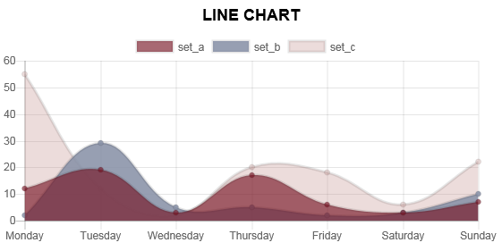
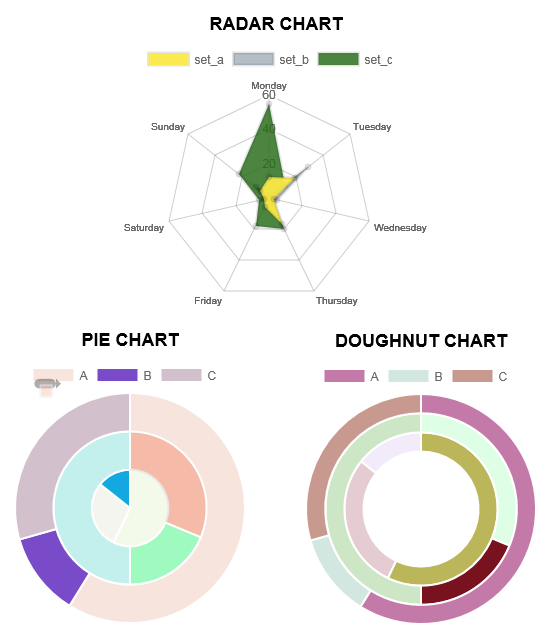

Effective Output
================

Clickable Element Links
-----------------------

work in progress

Progress bars
-------------

work in progress

Standard Forms
--------------

work in progress

Graphs
------

**Step 1:** Create a chart object for the chart type that you want. We'll add data to this later...

.. code-block:: python

    from pyrevit import script

    output = script.get_output()

    # Line chart
    chart = output.make_line_chart()
    # Bar chart
    chart = output.make_bar_chart()
    # Bubble chart
    chart = output.make_bubble_chart()
    # Radar chart
    chart = output.make_radar_chart()
    # Polar chart
    chart = output.make_polar_chart()
    # Pie chart
    chart = output.make_pie_chart()
    # Doughnut chart
    chart = output.make_doughnut_chart()

**Step 1-a:** Optional: Setup the chart title, and other options. the full list
of options for every chart is available on `Charts.js Documentation <http://www.chartjs.org/docs/>`_ page.
Some of the properties have their own sub-properties, for example the ``title`` option
for the charts has multiple sub-properties as shown below. The value for these
type of properties should be a dictionary of the sub-properties you'd like to set.
All this is explained clearly in the `Charts.js Documentation <http://www.chartjs.org/docs/>`_

.. code-block:: python

    chart.set_style('height:150px')

    chart.options.title = {'display': True,
                           'text':'Chart Title',
                           'fontSize': 18,
                           'fontColor': '#000',
                           'fontStyle': 'bold'}

**Step 2:** Now let's add data to the chart. Every chart object has a data property ``chart.data``
that we can interact with to add datasets to the chart. Different types of charts
need different types of data sets in terms of how data is organized, so the chart
can present multiple data sets correctly. I'm providing two examples here, one for
a simple line chart (showing 3 different data sets) and another for a radial chart
(also showing 3 different data sets within the same chart).
They're all very similar to each other though.

Line charts
^^^^^^^^^^^

See the comments in the script for more info

.. code-block:: python

    # this is a list of labels for the X axis of the line graph
    chart.data.labels = ['Monday', 'Tuesday',
                         'Wednesday', 'Thursday',
                         'Friday', 'Saturday', 'Sunday']

    # Let's add the first dataset to the chart object
    # we'll give it a name: set_a
    set_a = chart.data.new_dataset('set_a')
    # And let's add data to it.
    # These are the data for the Y axis of the graph
    # The data length should match the length of data for the X axis
    set_a.data = [12, 19, 3, 17, 6, 3, 7]
    # Set the color for this graph
    set_a.set_color(0xFF, 0x8C, 0x8D, 0.8)
    # You can also set custom options for this graph
    # See the Charts.js documentation for all the options
    set_b.fill = False

    # Same as above for a new data set: set_b
    set_b = chart.data.new_dataset('set_b')
    # Obviously a different set of data and a different color
    set_b.data = [2, 29, 5, 5, 2, 3, 10]
    set_b.set_color(0xFF, 0xCE, 0x56, 0.8)

    # Same as above for a new data set: set_c
    set_c = chart.data.new_dataset('set_c')
    # Obviously a different set of data and a different colorset_c.data = [55, 12, 2, 20, 18, 6, 22]
    set_c.set_color(0x36, 0xA2, 0xEB, 0.8)

And here is the result:

Pie charts
^^^^^^^^^^

See the comments in the script for more info

.. code-block:: python

    # Set the labels for the circumference axis
    chart.data.labels = ['A', 'B', 'C']

    # Create new data sets
    set_a = chart.data.new_dataset('set_a')
    set_a.data = [100, 20, 50]
    # You can set a different color for each pie of the chart
    set_a.backgroundColor = ["#560764", "#1F6CB0", "#F98B60"]

    set_b = chart.data.new_dataset('set_b')
    set_b.data = [50, 30, 80]
    set_b.backgroundColor = ["#913175", "#70A3C4", "#FFC057"]

    set_c = chart.data.new_dataset('set_c')
    set_c.data = [40, 20, 10]
    set_c.backgroundColor = ["#DD5B82", "#E7E8F5", "#FFE084"]

Other charts
^^^^^^^^^^^^

You can apply these data sets for radar, pie, polar, and doughnut (since they're all radial) charts and get different results:

**Step 3:** The last step is to ask the chart object to draw itself.

.. code-block:: python

    # Before drawing the chart you can randomize the colors
    # if you have not added any color to the datasets.
    chart.randomize_colors()

    # Finally let's draw the chart
    chart.draw()

Charts engine
^^^^^^^^^^^^^

Here is a little info on how the charts engine work:
the pyRevit charts module is ``pyrevit.coreutils.charts``.
This is the module that the output window interacts with to create the charts.

The charts module provides the chart object and handles the creation of datasets.
The first thing it does when drawing the graph is to create a html ``<canvas>``
element and assign a unique id to it:

.. code-block:: html

    <canvas id="chart123456"></canvas>

Then it parses the input data and create a JSON representation of the data.
The JSON string (`json_data`) will be inserted into a template javascript.
This javascript is in turn, creating a Chart object from the ``Chart.js`` library:

.. code-block:: javascript

    var ctx = document.getElementById('{}').getContext('2d');
    var chart = new Chart(ctx, json_data);

and finally, the pyRevit chart object, injects this dynamically created
javascript into the `<head>` of the output window WebBrowser component:

.. code-block:: python

    output.inject_script(js_code)
